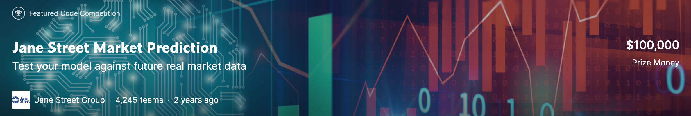
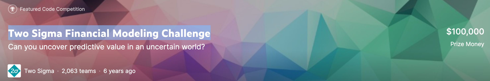
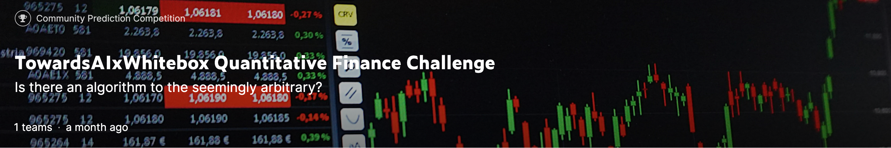

# 量化相关 Kaggle 竞赛和数据

## Jane Street Market Prediction

[链接](https://www.kaggle.com/competitions/jane-street-market-prediction)

遗憾的是数据集已经下架了，也许网上还有相关的备份，但是 Kaggle 官网上没有了。

## Two Sigma Financial Modeling Challenge

[链接](https://www.kaggle.com/competitions/two-sigma-financial-modeling/leaderboard)

遗憾的是数据集已经下架了，也许网上还有相关的备份，但是 Kaggle 官网上没有了。

## JPX Tokyo Stock Exchange Prediction

[链接](https://www.kaggle.com/competitions/jpx-tokyo-stock-exchange-prediction/data)

数据提供了东京交易所股票的日线，期权价格以及一些交易额数据。形成一个 long-short 投资组合。

[数据连接](https://drive.google.com/file/d/1dC6UcwGMBlOOKVi1oCourClp1sf9XBsw/view?usp=sharing)

## TowardsAIxWhitebox Quantitative Finance Challenge

[链接](https://www.kaggle.com/competitions/towardsai-x-whitebox-startup-challenge/overview)

数据集包含了 212 只股票和ETF。

## 400+ crypto currency pairs at 1-minute resolution

400+ 加密货币 1 分钟蜡烛图历史数据。

[链接](https://www.kaggle.com/datasets/tencars/392-crypto-currency-pairs-at-minute-resolution)